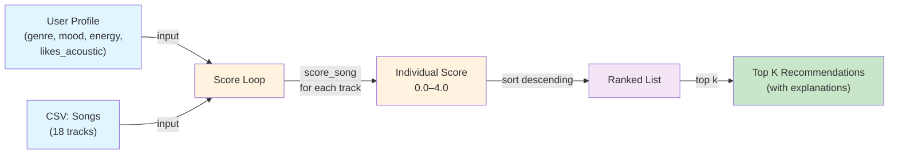

# 🎵 Music Recommender Simulation

## Project Summary

In this project you will build and explain a small music recommender system.

Your goal is to:

- Represent songs and a user "taste profile" as data
- Design a scoring rule that turns that data into recommendations
- Evaluate what your system gets right and wrong
- Reflect on how this mirrors real world AI recommenders

This simulation builds a content-based music recommender that scores songs against a user's taste profile using weighted feature matching. It prioritizes mood and energy as the primary "vibe" signals, supported by acousticness and genre as texture and style cues. The goal is to recommend songs that feel contextually right — not just popular or generically similar.

---

## How The System Works

Real-world recommenders like Spotify and YouTube use two main strategies: **collaborative filtering** (finding users with similar taste and surfacing what they love) and **content-based filtering** (analyzing the audio attributes of songs to match a listener's established preferences). Production systems combine both, but collaborative filtering requires large amounts of user behavior data that a small simulation cannot replicate. This version focuses on **content-based filtering**: each song is scored purely on how closely its attributes match the user's stated preferences, with no dependency on what other users have done.

This system will prioritize **mood and energy** as the dominant signals — they best capture the "vibe" a listener is seeking in a given context (studying, working out, winding down). Acousticness and genre serve as supporting signals that refine texture and style. All numeric features use a **proximity score** (`1 - |song_value - user_target|`) so that songs closest to the user's target win, rather than songs that are simply louder, faster, or more energetic.

### Data Flow



### Algorithm Recipe — Finalized Weights

Each song receives a score from **0.0 to 4.0** based on how closely it matches the user profile. The scoring rule is applied to every song in the catalog independently, then all songs are ranked by score (highest first).

**Point weights (additive):**

```
score(song, user) =
    1.40 × mood_match              (exact string match: 0 or 1)
  + 1.20 × energy_proximity        (scaled: 1 - |song.energy - user.target_energy|)
  + 0.80 × acousticness_proximity  (scaled: 1 - |song.acousticness - target_acoustic|)
  + 0.40 × genre_match             (exact string match: 0 or 1)
  + 0.20 × acoustic_bonus          (confirmation bonus when preference is clear)
  ───────────────────────────────
    MAX = 4.00 points
```

**Why these weights?**
- **Mood (1.40):** The strongest signal. Listeners prioritize vibe—"I want something chill"—over genre. A chill ambient track outscores an intense indie track for a calm listener, even though indie might match the genre.
- **Energy (1.20):** Second strongest. Energy spread in the catalog is wide (0.21–0.97), and proximity to a user's target is a key driver of satisfaction. Rewards closeness, not extremes.
- **Acousticness (0.80):** Meaningful but secondary. Separates "warm/organic" from "electronic/produced"—a key texture signal that many listeners notice instantly.
- **Genre (0.40):** Soft tiebreaker, not a hard gate. A genre mismatch doesn't kill a song, just costs points. This allows cross-genre substitutes to rank well if they match on mood/energy.
- **Acoustic bonus (0.20):** Small confirmation bonus when a song clearly reinforces the user's stated preference (acoustic lovers get a boost from acousticness > 0.6; electronic lovers get a boost from acousticness < 0.4).

**Example scoring:**
- User: `{genre: "lofi", mood: "chill", energy: 0.38, likes_acoustic: True}`
- Library Rain (lofi, chill, energy 0.35, acousticness 0.86):
  - Mood match: 1.40 ✓
  - Energy proximity: 1.20 × (1 - 0.03) = 1.16
  - Acousticness proximity: 0.80 × (1 - 0.06) = 0.75
  - Genre match: 0.40 ✓
  - Acoustic bonus: 0.20 ✓
  - **Total: 3.91 / 4.00**

- Storm Runner (rock, intense, energy 0.91, acousticness 0.10):
  - Mood match: 0 ✗
  - Energy proximity: 1.20 × (1 - 0.53) = 0.56
  - Acousticness proximity: 0.80 × (1 - 0.70) = 0.24
  - Genre match: 0 ✗
  - Acoustic bonus: 0 ✗
  - **Total: 0.80 / 4.00**

### `Song` features used

| Feature | Type | Role in scoring |
|---|---|---|
| `genre` | `str` | Categorical match — style and instrument family |
| `mood` | `str` | Categorical match — primary vibe signal (1.40 points) |
| `energy` | `float` 0.0–1.0 | Proximity to `target_energy` (0.0–1.20 points) |
| `acousticness` | `float` 0.0–1.0 | Proximity to acoustic preference (0.0–0.80 points) |
| `valence` | `float` 0.0–1.0 | Emotional positivity — available for future weighting |
| `danceability` | `float` 0.0–1.0 | Rhythmic feel — available for future weighting |
| `tempo_bpm` | `float` | BPM — available for context-specific filtering |

### `UserProfile` fields used

| Field | Type | How it's used |
|---|---|---|
| `favorite_genre` | `str` | Matched against `song.genre` (0.40 points if match) |
| `favorite_mood` | `str` | Matched against `song.mood` (1.40 points if match) |
| `target_energy` | `float` | Proximity score against `song.energy` (0.0–1.20 points) |
| `likes_acoustic` | `bool` | Maps to acoustic target: 0.8 if True, 0.2 if False (0.0–1.0 points) |

### Ranking and output

1. All 18 songs are scored using the above formula.
2. Scores are sorted in descending order.
3. The top `k` songs (default: 5) are returned to the user.
4. Each recommendation includes an explanation: why this song matched (mood, energy, acousticness, etc.).

---

## Potential Biases and Limitations

**Over-representation of mood bias:** Because mood is weighted 1.40 points (35% of total), a mood mismatch is nearly impossible to overcome. A user seeking "happy" music will almost never see a "sad" song, even if that sad song perfectly matches all other preferences. This is intentional but limits serendipity.

**Genre as tiebreaker, not gate:** Genre mismatch costs only 0.40 points. This means a lofi lover might see indie pop or ambient tracks ranked above lofi tracks with lower overall scores. In reality, many listeners have strong genre preferences and would prefer the lofi track regardless.

**No context awareness:** The system treats every recommendation request the same way. A user might want "chill" music at home but "energetic" music at the gym—this profile captures only one static preference. Real systems use session context (time of day, location, device) to adapt dynamically.

**No diversity constraint:** The recommender always picks the highest-scoring songs independently. If the top 5 recommendations happen to be all lofi, all from the same artist, or all from one subgenre, the user gets no variety. Real systems apply diversity constraints to avoid repetition.

**Catalog size:** Only 18 songs. In a real recommender with millions of tracks, the scoring logic would need to be orders of magnitude faster (using approximate nearest neighbor search instead of full scoring).

**No cold-start solution for new users:** The UserProfile requires explicit inputs. A brand-new user would need to fill in `favorite_genre`, `favorite_mood`, and `target_energy` before getting recommendations. Real systems use genre lists, onboarding questionnaires, or demographic priors to bootstrap.

---

## Getting Started

### Setup

1. Create a virtual environment (optional but recommended):

   ```bash
   python -m venv .venv
   source .venv/bin/activate      # Mac or Linux
   .venv\Scripts\activate         # Windows

2. Install dependencies

```bash
pip install -r requirements.txt
```

3. Run the app:

```bash
python -m src.main
```

### Running Tests

Run the starter tests with:

```bash
pytest
```

You can add more tests in `tests/test_recommender.py`.

### Example Output

Here's what the CLI produces for a "chill lofi acoustic" user:

```
================================================================================
🎵 MUSIC RECOMMENDER SIMULATION
================================================================================

📊 User Profile:
   • Favorite Genre: lofi
   • Favorite Mood: chill
   • Target Energy: 0.38
   • Prefers Acoustic: Yes ✓

📈 Top 5 Recommendations:

1. Library Rain
   Artist: Paper Lanterns | Genre: lofi | Mood: chill
   Score: 3.92/4.00  [███████████████████░] 98%
   Why:   'Library Rain' was recommended because: mood matches your 'chill' preference; 
          genre matches your favourite 'lofi'; energy (0.35) is close to your target (0.38); 
          has the acoustic texture you prefer.

2. Midnight Coding
   Artist: LoRoom | Genre: lofi | Mood: chill
   Score: 3.88/4.00  [███████████████████░] 97%
   Why:   'Midnight Coding' was recommended because: mood matches your 'chill' preference; 
          genre matches your favourite 'lofi'; energy (0.42) is close to your target (0.38); 
          has the acoustic texture you prefer.

3. Spacewalk Thoughts
   Artist: Orbit Bloom | Genre: ambient | Mood: chill
   Score: 3.38/4.00  [████████████████░░░░] 85%
   Why:   'Spacewalk Thoughts' was recommended because: mood matches your 'chill' preference; 
          energy (0.28) is close to your target (0.38); has the acoustic texture you prefer.

4. Focus Flow
   Artist: LoRoom | Genre: lofi | Mood: focused
   Score: 2.56/4.00  [████████████░░░░░░░░] 64%
   Why:   'Focus Flow' was recommended because: genre matches your favourite 'lofi'; 
          energy (0.4) is close to your target (0.38); has the acoustic texture you prefer.

5. Coffee Shop Stories
   Artist: Slow Stereo | Genre: jazz | Mood: relaxed
   Score: 2.12/4.00  [██████████░░░░░░░░░░] 53%
   Why:   'Coffee Shop Stories' was recommended because: energy (0.37) is close to your target (0.38); 
          has the acoustic texture you prefer.
================================================================================
```

**Observations:**
- **Library Rain (3.92)** is a perfect match — all signals align (mood + genre + energy + acoustic texture)
- **Midnight Coding (3.88)** is nearly identical, showing the algorithm handles close matches well
- **Spacewalk Thoughts (3.38)** is ambient (not lofi), but still ranks high because it matches on mood, energy, and texture — demonstrating that **genre is a soft signal, not a hard gate**
- **Focus Flow (2.56)** loses the mood match but keeps the genre + energy — mood drop is 1.40 points, dropping it below the ambient track
- **Coffee Shop Stories (2.12)** barely matches on energy alone, showing low correlation = low score

---

## Experiments You Tried

Use this section to document the experiments you ran. For example:

- What happened when you changed the weight on genre from 2.0 to 0.5
- What happened when you added tempo or valence to the score
- How did your system behave for different types of users

---

## Limitations and Risks

Summarize some limitations of your recommender.

Examples:

- It only works on a tiny catalog
- It does not understand lyrics or language
- It might over favor one genre or mood

You will go deeper on this in your model card.

---

## Reflection

Read and complete `model_card.md`:

[**Model Card**](model_card.md)

Write 1 to 2 paragraphs here about what you learned:

- about how recommenders turn data into predictions
- about where bias or unfairness could show up in systems like this


---

## 7. `model_card_template.md`

Combines reflection and model card framing from the Module 3 guidance. :contentReference[oaicite:2]{index=2}  

```markdown
# 🎧 Model Card - Music Recommender Simulation

## 1. Model Name

Give your recommender a name, for example:

> VibeFinder 1.0

---

## 2. Intended Use

- What is this system trying to do
- Who is it for

Example:

> This model suggests 3 to 5 songs from a small catalog based on a user's preferred genre, mood, and energy level. It is for classroom exploration only, not for real users.

---

## 3. How It Works (Short Explanation)

Describe your scoring logic in plain language.

- What features of each song does it consider
- What information about the user does it use
- How does it turn those into a number

Try to avoid code in this section, treat it like an explanation to a non programmer.

---

## 4. Data

Describe your dataset.

- How many songs are in `data/songs.csv`
- Did you add or remove any songs
- What kinds of genres or moods are represented
- Whose taste does this data mostly reflect

---

## 5. Strengths

Where does your recommender work well

You can think about:
- Situations where the top results "felt right"
- Particular user profiles it served well
- Simplicity or transparency benefits

---

## 6. Limitations and Bias

Where does your recommender struggle

Some prompts:
- Does it ignore some genres or moods
- Does it treat all users as if they have the same taste shape
- Is it biased toward high energy or one genre by default
- How could this be unfair if used in a real product

---

## 7. Evaluation

How did you check your system

Examples:
- You tried multiple user profiles and wrote down whether the results matched your expectations
- You compared your simulation to what a real app like Spotify or YouTube tends to recommend
- You wrote tests for your scoring logic

You do not need a numeric metric, but if you used one, explain what it measures.

---

## 8. Future Work

If you had more time, how would you improve this recommender

Examples:

- Add support for multiple users and "group vibe" recommendations
- Balance diversity of songs instead of always picking the closest match
- Use more features, like tempo ranges or lyric themes

---

## 9. Personal Reflection

A few sentences about what you learned:

- What surprised you about how your system behaved
- How did building this change how you think about real music recommenders
- Where do you think human judgment still matters, even if the model seems "smart"

